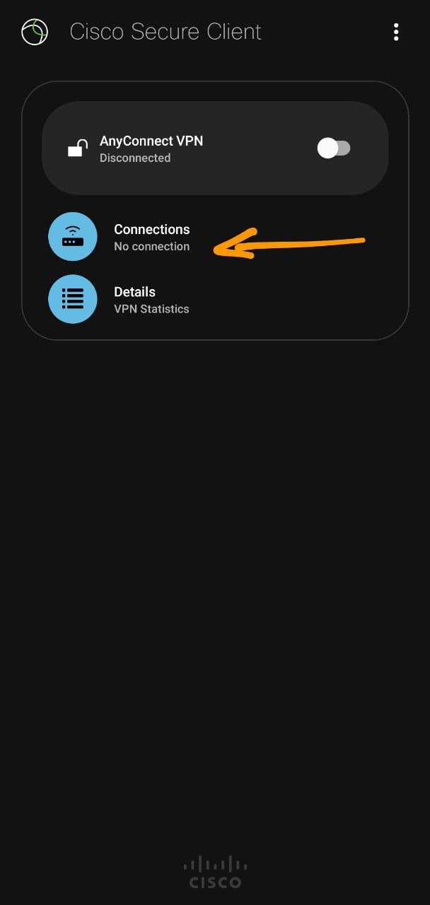
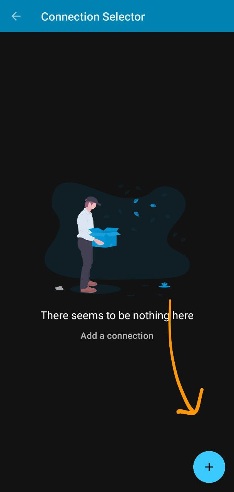
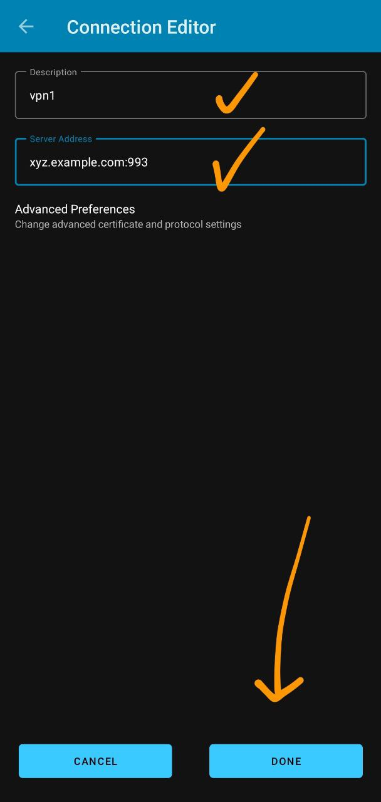
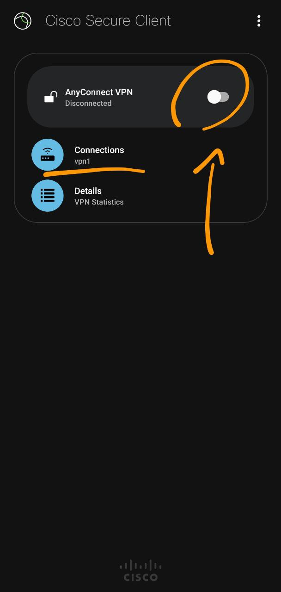
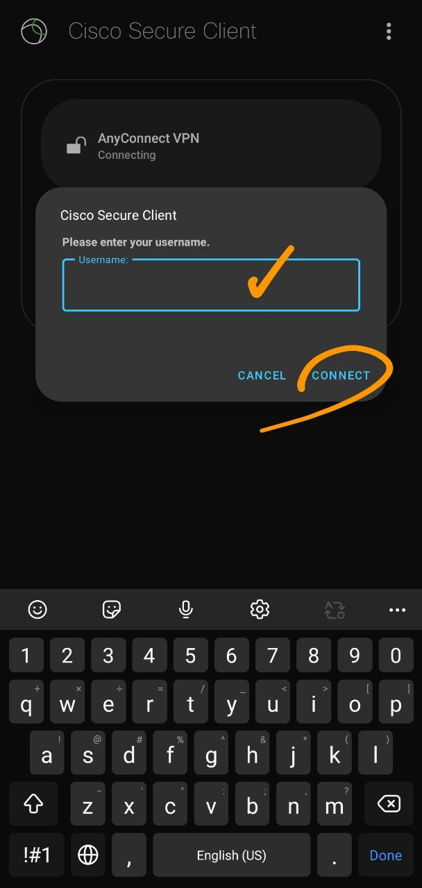
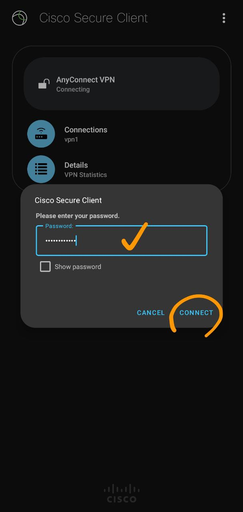
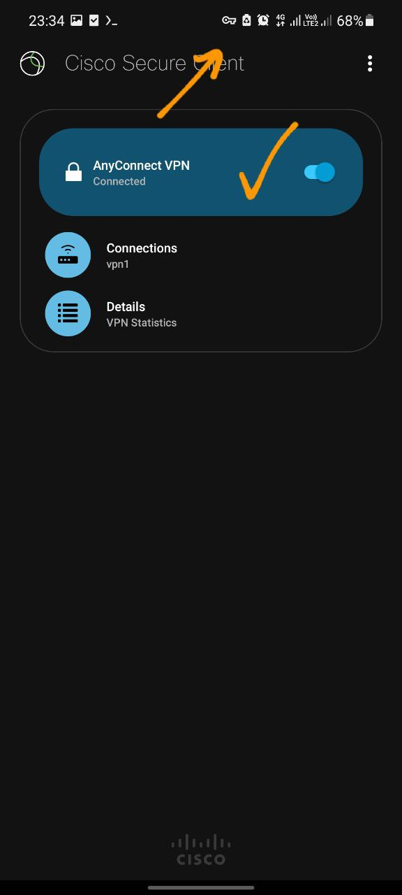

## برای گوشی اندروید – دانلود و نصب کنید

برنامه AnyConnect رو دانلود کنید

 - بعد از نصب برنامه رو باز کنید
 - از صفحه اصلی وارد قسمت Connections شوید
 - در قسمت پایین علامت + رو بزنید
 - سپس به ترتیب یک نام دلخواه (مثلا vpn) و ادرس رو وارد کنید
 - در قسمت آدرس بعد از وارد کردن آدرس و در ادامه ان پورت :993 رو وارد کنید
 - قسمت آدرس به این صورت می شود vpn.example.com:993
 - سپس در پایین صفحه دکمه DONE رو بزنید تا پروفایل ایجاد شود
 - بعد از ایجاد شدن پروفایل اون رو انتخاب کنید تا کنار آن یک تیک قرار بگیرد
 - بعد به صفحه اصلی برگردید و دکمه بالا که نوشته AnyConnect VPN رو بزنید
 - اگر به سرور وصل شود ازتون یوزرنیم میخواد وارد کنید
 - سپس از تون پسورد میخواد وارد کنید تا وصل شود

### تصاویر راهنما

