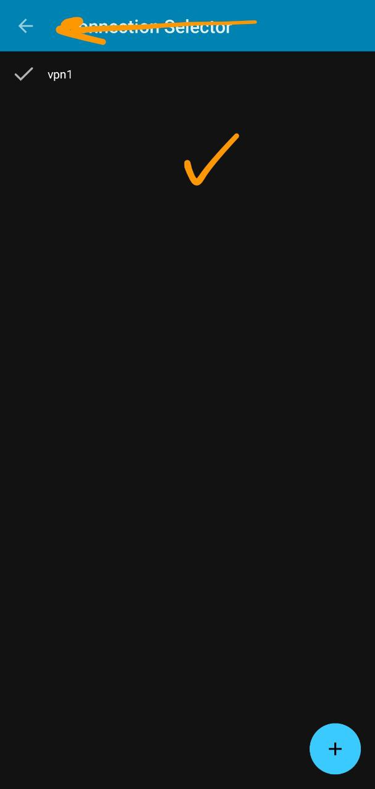

## برای گوشی اندروید – دانلود و نصب کنید

### برنامه AnyConnect رو دانلود کنید

- [دانلود نسخه قدیمی 4.8](https://github.com/r3vpn/client/releases/download/v1.0.0/Cisco-Secure-Client-AnyConnect-v4-8-03651.apk)
- [دانلود نسخه جدید 5](https://github.com/r3vpn/client/releases/download/v1.0.0/Cisco-Secure-Client-AnyConnect-5-0-01253.apk)
- [دانلود از گوگل پلی](https://play.google.com/store/apps/details?id=com.cisco.anyconnect.vpn.android.avf&hl=en_US)

### مراحل زیر رو دنبال کنید

 - بعد از نصب برنامه رو باز کنید
 - از صفحه اصلی وارد قسمت Connections شوید
 - در قسمت پایین علامت + رو بزنید تا یک پروفایل ایجاد شود
 - سپس به ترتیب یک نام دلخواه (مثلا vpn) و بعد ادرس رو وارد کنید
 - در قسمت آدرس بعد از وارد کردن آدرس و در ادامه ان پورت :993 رو وارد کنید
 - قسمت آدرس به این صورت می شود vpn.example.com:993
 - سپس در پایین صفحه دکمه DONE رو بزنید تا پروفایل ایجاد شود
 - بعد از ایجاد شدن پروفایل اون رو انتخاب کنید تا کنار آن یک تیک قرار بگیرد
 - بعد به صفحه اصلی برگردید و دکمه بالا که نوشته AnyConnect VPN رو بزنید
 - توجه کنید که نام (مثلا vpn) که برای پروفایل وارد کرده اید در قسمت Connections نشان داده میشود
 - برنامه ابتدا باید به سرور وصل شد، صبر کنید تا وصل شود
 - اگر وصل شد ازتون یوزرنیم میخواد اون وارد کنید
 - سپس از تون پسورد میخواد پسورد رو هم وارد کنید
 - اگر یوزرنیم و پسورد درست وارد شده باشد وصل میشود

### تصاویر راهنما

