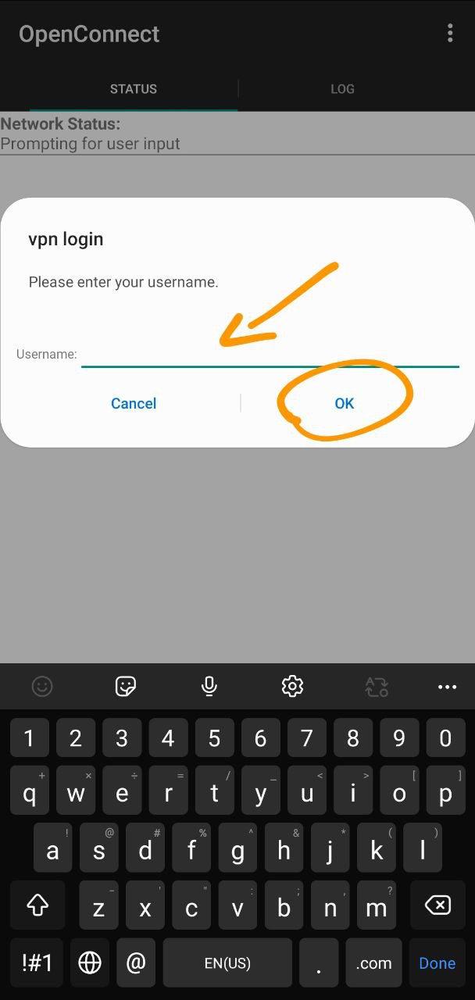

## برای گوشی اندروید – دانلود و نصب کنید

### برنامه OpenConnect رو دانلود کنید

- [لینک مستقیم نسخه اول](https://github.com/r3vpn/client/releases/download/v1.0.0/OpenConnect-1-05.apk)
- [لینک مستقیم نسخه دوم](https://github.com/r3vpn/client/releases/download/v1.0.0/OpenConnect-1-15.apk)
- [دانلود از گوگل پلی](https://play.google.com/store/apps/details?id=com.github.digitalsoftwaresolutions.openconnect&hl=en_US)

### مراحل زیر رو دنبال کنید

 - بعد از نصب برنامه رو باز کنید
 - روی علامت + بزنید تا یک پروفایل ایجاد شود
 - ازتون ادرس میخواد ادرس رو وارد کنید و جلوی اون پورت هم وارد کنید
 - به این صورت می شود vpn.example.com:993 که پورت ۹۹۳ است
 - دکمه عقب رو بزنید و به صفحه اصلی برنامه برگردید
 - یک پروفایل ایجاد شده است رو ان بزنید
 - از تون یوزرنیم میخواد وارد کنید
 - بعد ازتون پسورد میخواد وارد کنید و تیک گزینه save password رو بزنید
 - اگر خطا نداشته باشد متصل می شود

### تصاویر راهنما

