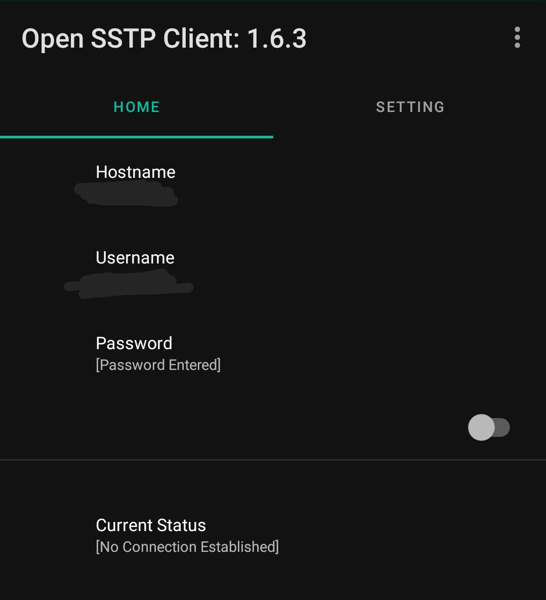
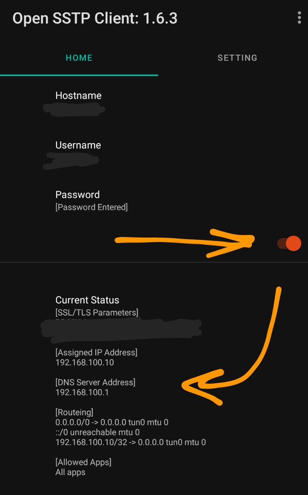

## برای گوشی اندروید – دانلود و نصب کنید

### برنامه  Open SSTP رو دانلود کنید

- [دانلود مستقیم](https://github.com/kittoku/Open-SSTP-Client/releases/download/v1.6.3/osc-1.6.3.apk)
- [دانلود از گوگل پل](https://play.google.com/store/apps/details?id=kittoku.osc&hl=en&gl=US)

### مراحل زیر رو دنبال کنید

 - بعد از نصب برنامه رو باز کنید
 - سه مورد بالا که قرمز رنگ است رو به ترتیب وارد کنید
 - آدرس رو در قسمت hostname وارد کنید
 - یوزرنیم را در قسمت username وارد کنید
 - پسورد را در قسمت password وارد کنید
 - به هیچ گزینه دیگه ای دست نزنید
 - دکمه پایین رو بزنید تا متصل شود
 - اگر متصل شود رنگ آن نارنجی می شود و متصل می ماند
 - اگر دکمه نارنجی نشد و به عقب برگشت متصل نشد است

### ویدیو راهنما 

https://user-images.githubusercontent.com/124795614/235293850-b255ce09-21d1-45b6-83f1-ab032d185e64.mp4

### تصاویر راهنما

 - محیط برنامه

 - وصل شدن برنامه

