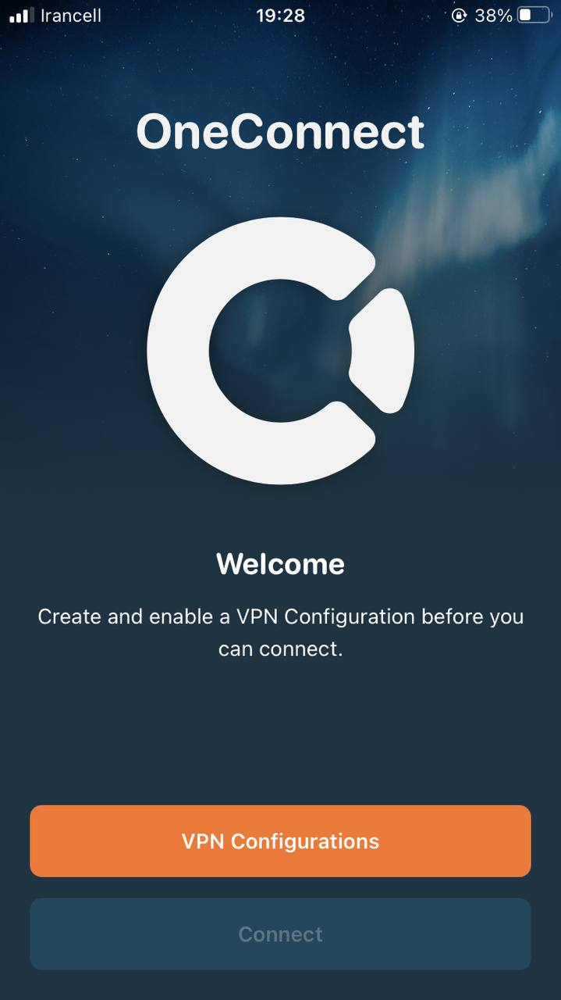
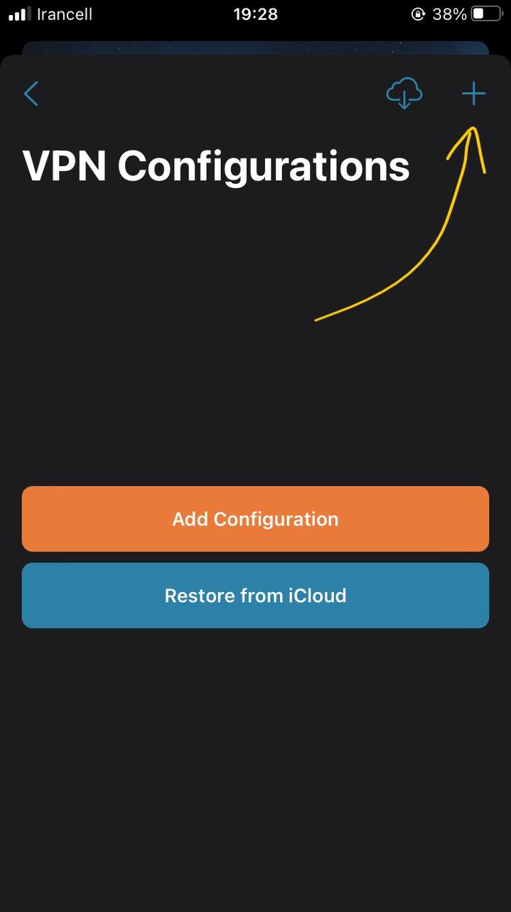
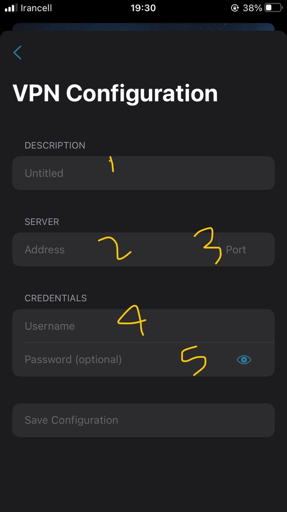
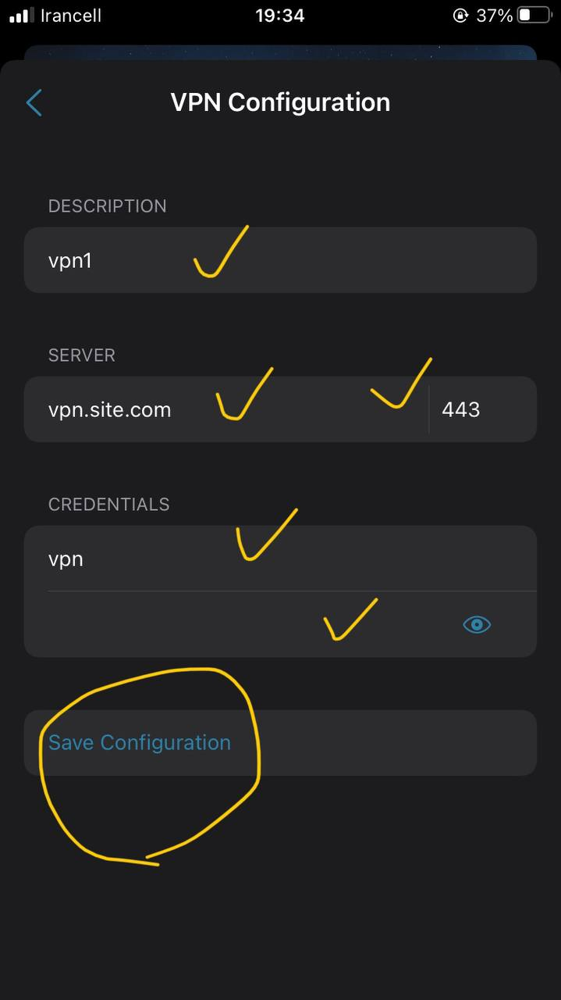
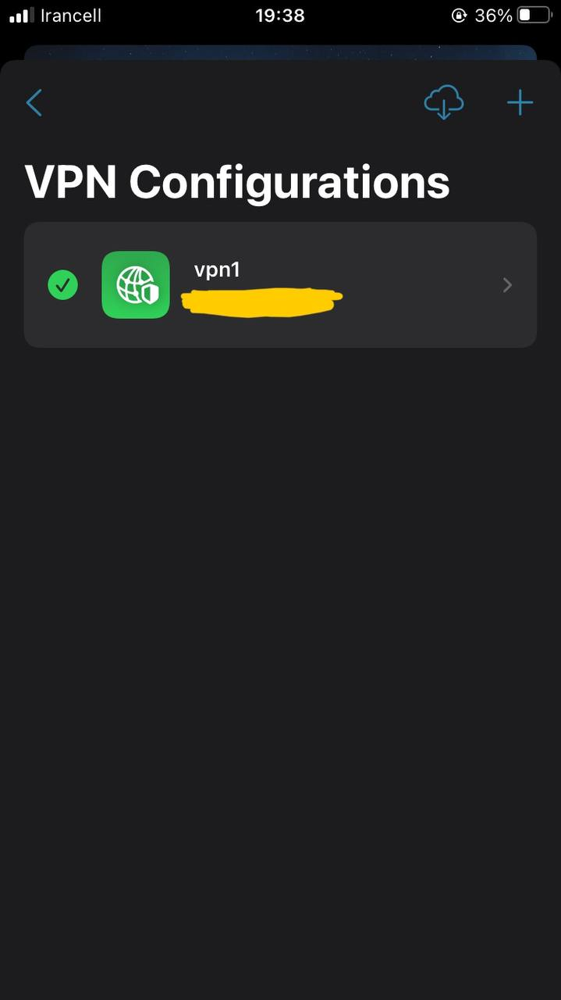
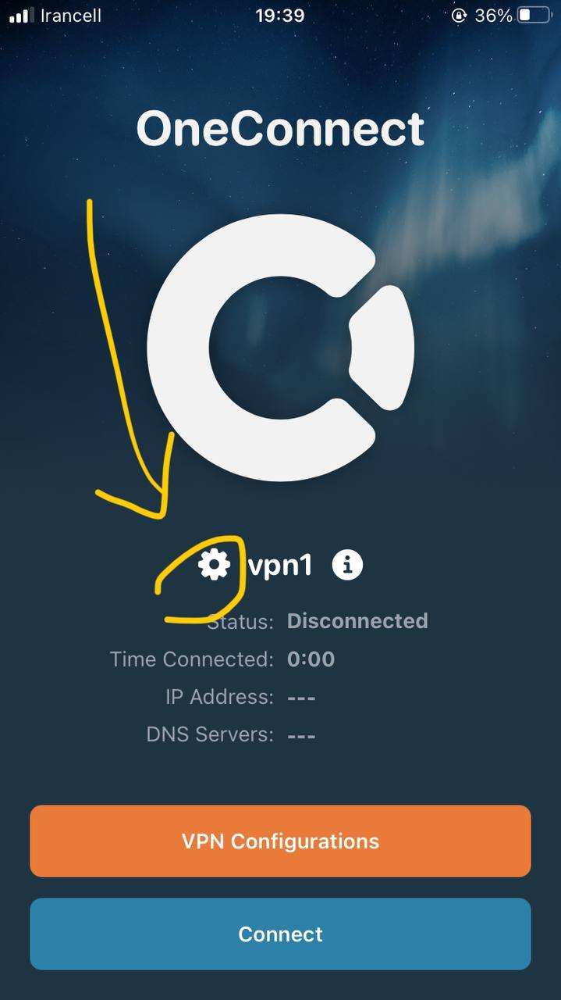
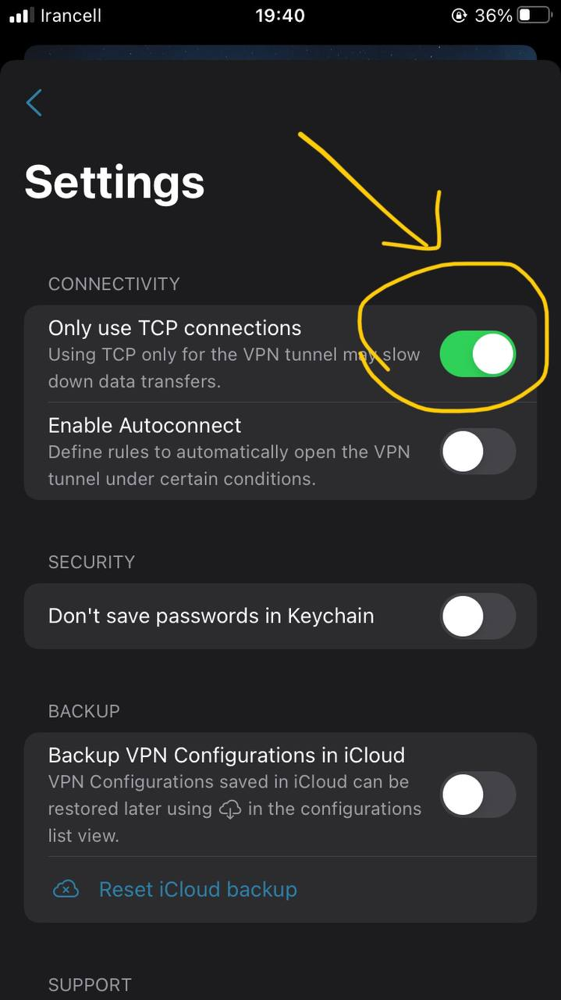
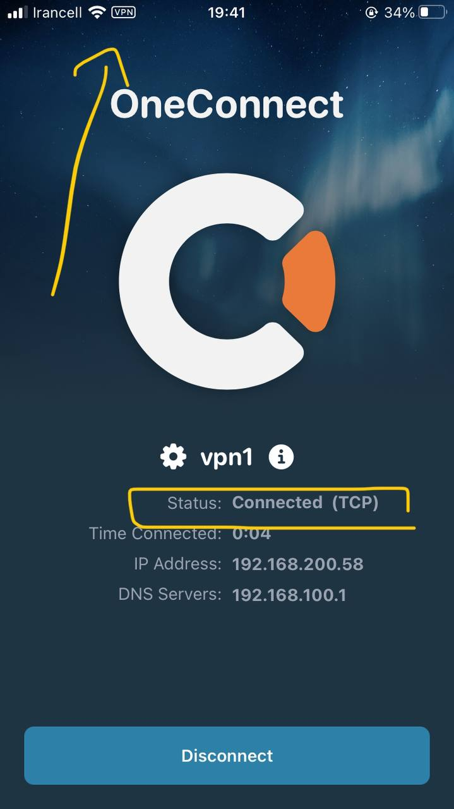

## برای گوشی آیفون – در اپ استور جستجو و نصب کنید

برنامه Clavister OneConnect از طریق اپ ستور نصب کنید

 - بعد از نصب برنامه رو باز کنید
 - در صفحه اصلی گزینه VPN Configurations رو بزنید
 - در صفحه جدید گوشه سمت راست بالا علامت + رو بزنید
 - برای DESCRIPTION یک نام دلخواد مثلا vpn وارد کنید
 - برای ادرس ادرس رو وارد کنید
 - برای پورت 993 رو وارد کنید
 - یوزرنیم و پسورد رو هم به ترتیب وارد کنید
 - سپس گزینه Save Configuration رو بزنید تا پروفایل ایجاد شود
 - دکمه عقب رو بزنید و به عقب برگردید و پروفایل رو انتخاب کنید تا تیک بخورد
 - مجدد به عقب برگردید و وارد صفحه اصلی شوید
 - در صفحه اصلی کنار نام پروفایل یک علامت چرخ دنده کوچک هست روی ان بزنید
 - در این قسمت گزینه اول Only use TCP connections رو روشن کنید و به عقب برگردید
 - سپس رو دکمه Connect بزنید تا وصل شود

